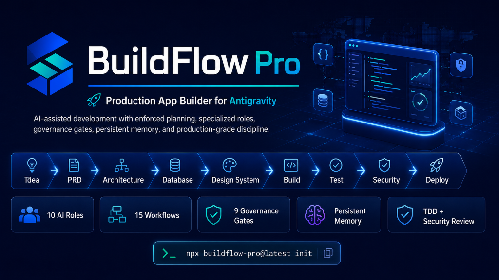
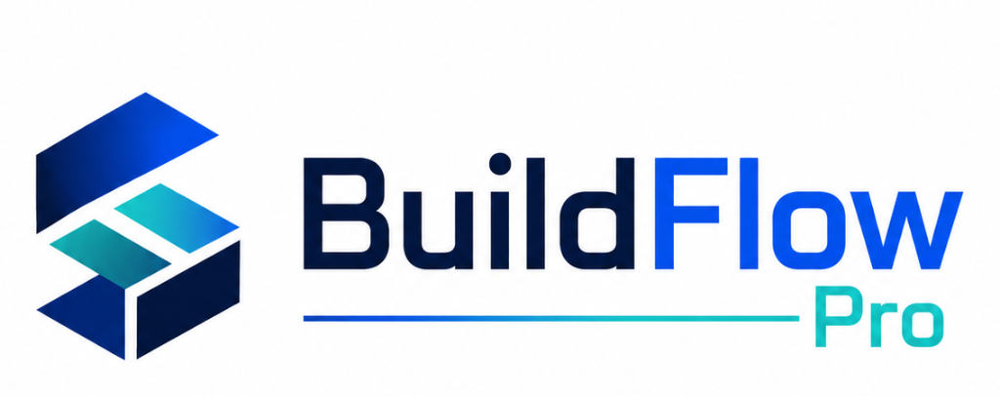

<p align="center">
  
</p>

<p align="center">
  
</p>

# BuildFlow Pro — Production App Builder for Antigravity

> **A complete, installable build operating system for AI-assisted development — with enforced planning, specialized roles, governance gates, persistent memory, and production-grade discipline baked in from day one.**

[](https://www.npmjs.com/package/buildflow-pro)
[](https://www.npmjs.com/package/buildflow-pro)
[](https://github.com/eybersjp/buildflow-pro/actions/workflows/ci.yml)
[](LICENSE)
[](CONTRIBUTING.md)
[](https://deepmind.google)

---

## The Problem

AI coding agents are powerful. But production apps require discipline that most agents don't enforce by default.

Unchecked AI builds typically:
- Jump to code before requirements are understood
- Skip database design entirely
- Ship with no tests
- Have no security review
- Have no rollback plan
- Lose context mid-session and restart from scratch
- Deploy to production without a formal sign-off

BuildFlow Pro prevents every one of these failure modes.

---

## What BuildFlow Pro Is

BuildFlow Pro is an **installable skill and workflow system** for Google Antigravity (and compatible AI coding agents).

It gives the agent:

| What | How |
|---|---|
| **11 specialized AI roles** | Product Manager, Architect, DB Engineer, Frontend, Backend, QA, Security, DevOps, Release Manager, Docs Writer, Design Engineer |
| **10 intelligence sub-skills** | Karpathy Discipline, Design system generator, TDD loop, Playwright E2E, safe Postgres queries, architecture patterns, multi-agent orchestration, changelog generator, component patterns, error handling |
| **15 structured build workflows** | Step-by-step guides from discovery to deployment |
| **Modes** | 🏆 **Production Mode:** Standard enterprise-grade discipline (9-Gate Governance, TDD, Full Docs). 🚀 **Prototype Mode:** Fast-track build for hackathons. Skips heavy planning and relaxes strict rules. |
| **6 always-on rule files** | Global rules, coding rules, security rules, testing rules, deployment rules, API contract rules |
| **Persistent memory layer** | task-plan, architecture knowledge graph, learned patterns — survive context compaction |
| **11 commands** | `/plan`, `/plan:status`, `/context-mode`, `/visualize-architecture`, `/build-feature`, and more |
| **9-Gate governance model** | Scope, Architecture, Security, DataIntegrity, APIContract, Performance, TestCoverage, Compliance, Release |
| **Beautiful doc templates** | README, CONTRIBUTING, API docs — ready to adapt |

---

## Quick Start

### Install (Windows — PowerShell)

```powershell
cd your-project
.\path\to\buildflow-pro\install.ps1
```

### Install (Mac / Linux — Bash)

```bash
cd your-project
chmod +x path/to/buildflow-pro/install.sh && ./install.sh
```

### Install via npm

```bash
cd your-project
npx buildflow-pro@latest init
```

### Start Building

Open your project in Antigravity, then:

```
/start-production-app
```

The system guides you from idea → PRD → architecture → database → design system → build → test → security → deploy.

---

## The Build Loop

```
1.  /start-production-app         ← You run this once
    ↓
2.  Guided discovery questions    ← Agent asks 12 questions
    ↓
3.  PRD generated                 ← docs/PRD.md
    ↓
4.  Architecture generated        ← docs/ARCHITECTURE.md + knowledge graph
    ↓
5.  Database designed             ← docs/DATABASE_SPEC.md + migration
    ↓
6.  Design system generated       ← docs/DESIGN_SYSTEM.md + CSS tokens
    ↓
7.  UI/UX plan generated          ← docs/UI_UX_SPEC.md
    ↓
8.  ✋ YOU APPROVE THE PLAN
    ↓
9.  Dev tooling configured        ← ESLint + Prettier + TypeScript strict + Husky
    ↓
10. /build-feature [feature]      ← Build one feature at a time
    ├── TDD: Test Spec → Red → Green → Refactor
    ├── Frontend: 5-state UI (loading, empty, error, success, denied)
    ├── Backend: Result<T> pattern + audit log
    ├── Security review (gate check)
    └── E2E tests written
    ↓
11. /security-audit               ← All 9 governance gates evaluated
    ↓
12. /deploy-preview               ← Staging deployment + verification
    ↓
13. ✋ YOU APPROVE PRODUCTION DEPLOY
    ↓
14. /production-release           ← Changelog generated, git tag, go live
    ↓
15. Monitoring activates          ← Sentry + PostHog confirmed
```

---

## Commands

| Command | Description |
|---|---|
| `/start-production-app` | Full guided build from idea to plan |
| `/plan` | Create or update the persistent project task plan |
| `/plan:status` | Read-only status snapshot of current phase and gates |
| `/context-mode` | Advanced context management — load, compress, snapshot |
| `/visualize-architecture` | Generate Mermaid architecture diagrams from knowledge graph |
| `/build-feature` | Build one feature safely with TDD + E2E + security review |
| `/review-code` | Full code review against production standards |
| `/security-audit` | All 9 governance gates + OWASP checklist |
| `/deploy-preview` | Deploy to preview/staging + verify |
| `/production-release` | Full production deploy with changelog + ReleaseGate |
| `/generate-docs` | Generate project docs using beautiful-docs templates |

---

## Skills — Core Roles

| Role | File | Responsibility |
|---|---|---|
| 🎯 Product Manager | `skills/product-manager/SKILL.md` | PRD, user stories, acceptance criteria, roadmap |
| 🏗️ Software Architect | `skills/software-architect/SKILL.md` | System design, ADRs, architecture graph |
| 🗄️ Database Engineer | `skills/database-engineer/SKILL.md` | Schema, migrations, RLS, indexes |
| 🎨 Frontend Engineer | `skills/frontend-engineer/SKILL.md` | Pages, components, forms, 5-state UI |
| 🪄 Design Engineer | `skills/design-engineer/SKILL.md` | Brand-grade prototypes, web/mobile mocks, design systems |
| ⚙️ Backend Engineer | `skills/backend-engineer/SKILL.md` | Services, API routes, validation, audit |
| 🧪 QA Engineer | `skills/qa-engineer/SKILL.md` | Test plans, unit tests, E2E, coverage gates |
| 🔒 Security Engineer | `skills/security-engineer/SKILL.md` | OWASP review, all 9 governance gates |
| 🚀 DevOps Engineer | `skills/devops-engineer/SKILL.md` | CI/CD, deployment, monitoring |
| 📋 Release Manager | `skills/release-manager/SKILL.md` | GO/NO-GO, changelog, ReleaseGate |
| ✍️ Documentation Writer | `skills/documentation-writer/SKILL.md` | Docs, API docs, README generation |

---

## Skills — Intelligence Sub-Skills

| Sub-Skill | File | Source Pattern |
|---|---|---|
| 🎨 UI Design System Generator | `frontend-engineer/ui-design-system.md` | ui-ux-pro-max-skill |
| 🧱 React Component Patterns | `frontend-engineer/component-patterns.md` | Code-Kit-Ultra |
| 🔴 Test-Driven Development | `qa-engineer/test-driven-development.md` | awesome-claude-skills |
| 🎭 Playwright Web App Testing | `qa-engineer/webapp-testing.md` | awesome-claude-skills |
| 🐘 Postgres Safe Queries | `database-engineer/postgres-safe-queries.md` | awesome-claude-skills |
| 🏛️ Architecture Patterns | `software-architect/software-architecture.md` | awesome-claude-skills |
| 🤖 Multi-Agent Orchestration | `software-architect/subagent-driven-development.md` | great_cto |
| 📝 Changelog Generator | `release-manager/changelog-generator.md` | awesome-claude-skills |
| 🛠️ Dev Tooling Setup | `devops-engineer/dev-tooling-setup.md` | awesome-devtools |
| ❗ Error Handling Patterns | `backend-engineer/error-handling-patterns.md` | antigravity-awesome-skills |

---

## Governance Model

BuildFlow Pro enforces **9 gates** across every production release:

| Gate | Description | Enforced In |
|---|---|---|
| ScopeGate | Feature matches PRD acceptance criteria | product-manager skill |
| ArchitectureGate | No architecture invariants violated | software-architect skill + coding-rules.md |
| SecurityGate | OWASP risk score, auth/RLS verified | security-engineer skill |
| DataIntegrityGate | Schema changes have migrations and rollbacks | database-engineer skill |
| APIContractGate | No breaking changes without versioning | api-contract-rules.md |
| PerformanceGate | LCP < 2.5s, TTFB < 200ms, query < 100ms | testing-rules.md |
| TestCoverageGate | Service layer ≥ 80%, E2E covers happy + error paths | testing-rules.md |
| ComplianceGate | GDPR, data retention, PII protection | security-rules.md |
| ReleaseGate | **Human approval required** — no autonomous production deploy | release-manager skill |

All 9 gates are evaluated by the Security Engineer before every production release. Any gate failure = NO-GO.

---

## Memory System

BuildFlow Pro projects maintain a **persistent memory layer** that survives context compaction:

| File | Purpose |
|---|---|
| `memory/task-plan.md` | Current task, phase, active blockers, open questions — read at every session start |
| `memory/architecture-graph.md` | Knowledge graph: God Nodes, Component Map, Surprising Connections, ADR Index |
| `memory/learned-patterns.md` | 20+ production patterns pre-seeded, grows with every project session |
| `memory/project-context.md` | App name, tech stack, key decisions — the project identity |
| `memory/decisions.md` | Log of all significant decisions made |
| `memory/changelog.md` | Internal dev-focused changelog |
| `memory/debug-log.md` | Session debug log — notable errors and resolutions |

---

## Rules — Always On

These rules are active in every session without needing to be invoked:

| Rule File | What It Governs |
|---|---|
| `global-rules.md` | Think in Code mandate, response discipline, output compression, phase gates |
| `coding-rules.md` | Architecture invariants, API contract safety, schema safety, UI anti-patterns, performance thresholds |
| `security-rules.md` | RLS requirements, no-secrets-in-code, ComplianceGate (GDPR/PII) |
| `testing-rules.md` | TestCoverageGate floors (service ≥ 80%), PerformanceGate test requirements |
| `deployment-rules.md` | Deployment order, rollback protocol, pre-deploy checklist, 30-min monitoring window |
| `api-contract-rules.md` | Breaking vs. non-breaking changes, versioning strategy, contract drift prevention |

---

## What Gets Installed

```
your-project/
  .antigravity/
    rules/
      core-rules-dense.md            ← Minified core governance (saves 90% tokens)
      appendix/
        global-rules.md              ← Deep context (lazy loaded)
        coding-rules.md
        security-rules.md
        testing-rules.md
        deployment-rules.md
        api-contract-rules.md
    workflows/
      00-start-production-app.md     ← Entry point
      01-product-discovery.md
      02-prd-generation.md
      03-architecture-design.md      ← + knowledge graph population
      04-database-design.md
      05-ui-ux-design.md             ← + design system generation
      06-project-scaffold.md
      07-feature-build.md            ← + TDD + E2E integration
      08-testing.md
      09-security-audit.md
      10-deployment.md
      11-release-review.md           ← + changelog generation
      12-monitoring.md
      13-maintenance.md
      workflow-router.md
    skills/
      product-manager/
        SKILL.md
        templates/prd-template.md
        templates/roadmap-template.md
      software-architect/
        SKILL.md
        software-architecture.md     ← Pattern decision framework
        subagent-driven-development.md ← Multi-agent orchestration
        templates/adr-template.md
      database-engineer/
        SKILL.md
        postgres-safe-queries.md     ← 8 safe query patterns
        templates/schema-template.sql
      frontend-engineer/
        SKILL.md
        ui-design-system.md          ← Industry design system generator
        component-patterns.md        ← 6 React component patterns
        templates/page-template.tsx
      design-engineer/
        SKILL.md
        templates/
      backend-engineer/
        SKILL.md
        error-handling-patterns.md   ← Result<T> + typed errors
        templates/service-template.ts
      qa-engineer/
        SKILL.md
        test-driven-development.md   ← Red/Green/Refactor TDD
        webapp-testing.md            ← Playwright E2E + accessibility
        templates/playwright-template.ts
      security-engineer/
        SKILL.md
      devops-engineer/
        SKILL.md
        dev-tooling-setup.md         ← ESLint + Prettier + TypeScript + Husky
        templates/github-actions-template.yml
      release-manager/
        SKILL.md
        changelog-generator.md       ← Keep a Changelog + SemVer
        templates/release-checklist.md
      documentation-writer/
        SKILL.md
    commands/
      start-production-app.md
      plan.md                        ← /plan command
      plan-status.md                 ← /plan:status command
      context-mode.md                ← /context-mode command
      visualize-architecture.md      ← /visualize-architecture command
      build-feature.md
      review-code.md
      security-audit.md
      deploy-preview.md
      production-release.md
    templates/
      master-prd.md
      technical-architecture.md
      production-readiness-checklist.md
      beautiful-docs/
        README-template.md           ← Project README template
        CONTRIBUTING-template.md     ← Contributing guide template
        API-docs-template.md         ← API documentation template
    memory/
      task-plan.md                   ← Session continuity (read at every session start)
      architecture-graph.md          ← Knowledge graph (God Nodes, Surprising Connections)
      learned-patterns.md            ← 20+ production patterns, grows with project
      project-context.md
      project-state.md
      decisions.md
      risks.md
      changelog.md
      debug-log.md                   ← Session debug log
  docs/                              ← Generated by BuildFlow Pro
    PRD.md
    ARCHITECTURE.md
    ARCHITECTURE_DIAGRAM.md
    DESIGN_SYSTEM.md
    DATABASE_SPEC.md
    UI_UX_SPEC.md
    API_SPEC.md
    BUILD_ROADMAP.md
    SECURITY_AUDIT.md
    RELEASE_REPORT.md
    ADR/
      0001-architecture-choice.md
      ...
  database/
    migrations/
    rollback/
    seeds/
  src/
    styles/
      design-tokens.css              ← Generated CSS custom properties
  .gemini/
    settings.json                    ← SessionStart/PreToolUse/PostToolUse hooks
```

---

## Safety Model

BuildFlow Pro enforces **mandatory human approval** before:

| Action | Gate |
|---|---|
| 🔴 Running database migrations | DataIntegrityGate + human approval |
| 🔴 Changing RLS policies | SecurityGate + human approval |
| 🔴 Deploying to production | ReleaseGate — **explicit "I approve this release" required** |
| 🔴 Changing authentication logic | SecurityGate |
| 🔴 Adding/removing API routes | APIContractGate review |
| 🔴 Deleting files | Scope confirmation |
| 🔴 Modifying payment logic | SecurityGate + human approval |
| 🔴 Touching production env vars | human approval |

**The AI will never autonomously deploy to production.** The ReleaseGate cannot be bypassed.

---

## Sessions & Context

BuildFlow Pro uses the **context-mode pattern** for session management:

- **Session start:** Automatically reads `task-plan.md` and `project-context.md`
- **Pre-build:** Scans `learned-patterns.md` for relevant patterns
- **Post-write:** Prompts to update `changelog.md` and `learned-patterns.md`
- **Context compression:** `/context compress` snapshots state before compaction
- **Recovery:** After compaction, reads `task-plan.md` to resume without re-explanation

---

## Version History

| Version | What Changed |
| :--- | :--- |
| **v2.2.0 (Current)** | **The Karpathy Discipline Update** — Integrated Andrej Karpathy's coding principles (Think Before Coding, Simplicity First, Surgical Changes, Goal-Driven Execution) into the core ruleset to reduce LLM coding pitfalls. |
| v2.1.0 | **The Design Engineer Update** — Added 11th AI role: Design Engineer. Artifact-first design workflow with 5-dimensional self-critique. |
| v1.2.0 | **The Speed & Scale Update** — Added **Prototype Mode** for hackathons, skipping documentation/governance. Added `/mode` command. |
| v1.1.0 | **The Token Diet Update** — Minified all 6 rule files into a single `core-rules-dense.md`. |
| v1.0.3 | **Official Public NPM Release** — Includes all features from Phases 1, 2, and 3. CLI NPM execution fixed for Windows. |
| v1.0.0 | Phase 3: beautiful-docs templates, dev tooling setup, component patterns, error handling patterns, context-mode command, architecture visualization, API docs template, debug log |
| v0.2.0 | Phase 2: design system generator, TDD loop, Playwright E2E, safe postgres queries, architecture patterns, multi-agent orchestration, changelog generator, knowledge graph |
| v0.1.0 | Phase 1: 10 skills, 15 workflows, 6 rule files, 9-gate governance, persistent task planning |

---

## Extending BuildFlow Pro

BuildFlow Pro is designed to be extended:

1. **Add a sub-skill:** Create a `.md` file in the relevant skill directory following the SKILL.md anatomy (frontmatter, process, verification gates, red flags, anti-rationalisations)
2. **Add a workflow:** Create a numbered `.md` file in `workflows/` following the workflow template
3. **Add a command:** Create a `.md` file in `commands/` with trigger conditions and step-by-step instructions
4. **Add a rule:** Add a new section to the relevant rule file, or create a new rule file if the domain is distinct
5. **Add a memory file:** Create a new `.md` in `memory/` and reference it from `task-plan.md`

---

## Philosophy

> Plan before you build. Test before you ship. Review before you deploy. Approve before it goes live.

BuildFlow Pro is opinionated because production discipline is not optional. Every gate, every rule, and every approval requirement exists because skipping it has caused real production incidents.

The system is strict so your product doesn't have to be embarrassing.

---

## License

MIT — Free to use, fork, and extend. Attribution appreciated but not required.

---

*Built by the community, for production. Every pattern is sourced from real-world systems that ship.*
