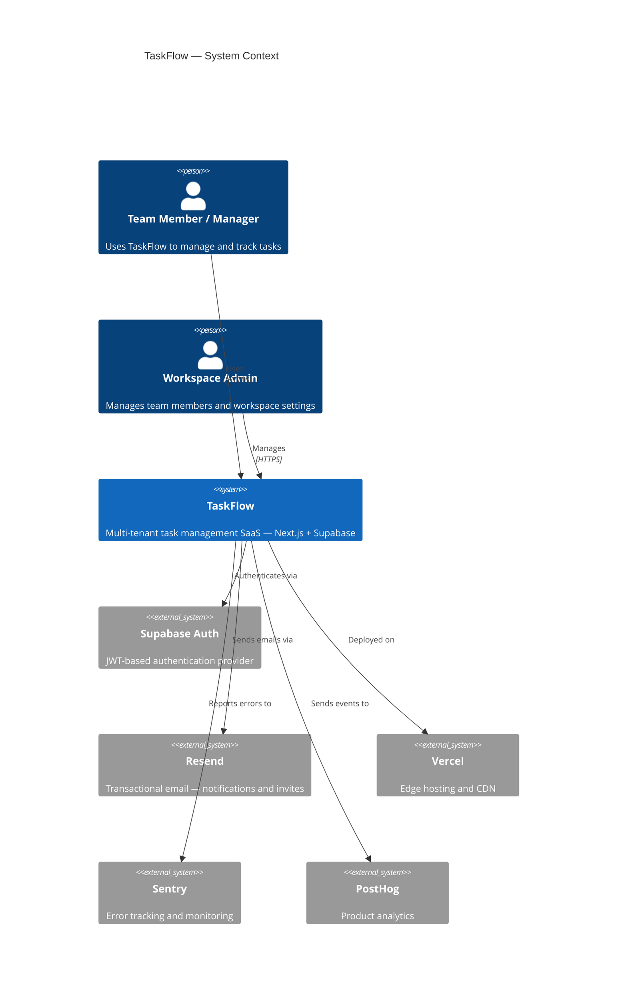
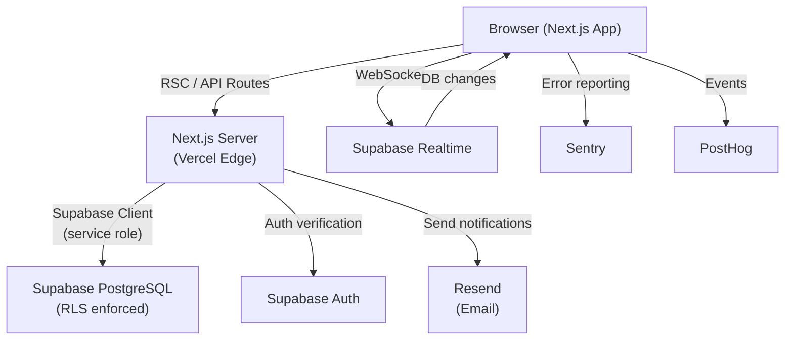
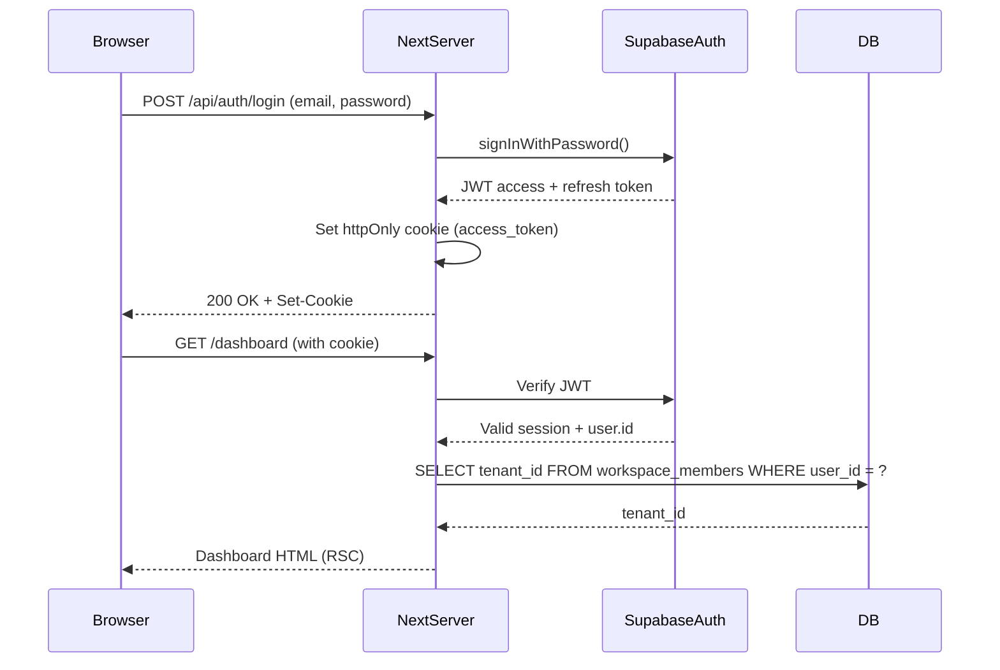

# Technical Architecture

**Project:** TaskFlow
**Version:** 1.0 (MVP)
**Status:** Approved
**Date:** 2026-05-13
**Author:** Software Architect (BuildFlow Pro)

---

## 1. System Context



---

## 2. Tech Stack

| Layer | Technology | Justification |
|---|---|---|
| **Frontend** | Next.js 14 (App Router) + TypeScript | Server components, RSC streaming, type safety |
| **UI** | Tailwind CSS + shadcn/ui | Composable, accessible component primitives |
| **State** | Zustand (client) + SWR (server) | Minimal footprint, easy invalidation |
| **Database** | Supabase PostgreSQL | Managed Postgres, RLS, Realtime built-in |
| **Auth** | Supabase Auth | JWT, email auth, session management |
| **Realtime** | Supabase Realtime | WebSocket subscriptions for board live updates |
| **Email** | Resend + React Email | Developer-friendly transactional email |
| **Hosting** | Vercel | Zero-config Next.js, edge CDN, preview URLs |
| **CI/CD** | GitHub Actions | Test + lint on PR, auto-deploy to Vercel |
| **Monitoring** | Sentry + PostHog | Error tracking + product analytics |

---

## 3. Architecture Diagram



---

## 4. Frontend Architecture

### Directory Structure

```
src/
  app/
    (auth)/
      login/page.tsx
      signup/page.tsx
      reset-password/page.tsx
    (dashboard)/
      layout.tsx           ← Auth guard, workspace context
      page.tsx             ← My Tasks (default view)
      board/page.tsx       ← Team Kanban board
      projects/
        page.tsx           ← Project list
        [id]/page.tsx      ← Project tasks
      settings/
        page.tsx           ← Workspace settings
        members/page.tsx   ← Member management
    api/
      tasks/route.ts
      comments/route.ts
      invites/route.ts
      notifications/route.ts
  components/
    tasks/
      TaskCard.tsx         ← 5-state: loading, empty, error, success, denied
      TaskDetail.tsx
      TaskForm.tsx
      TaskBoard.tsx        ← Kanban columns
    projects/
      ProjectCard.tsx
      ProjectList.tsx
    notifications/
      NotificationBell.tsx
      NotificationList.tsx
    ui/                    ← shadcn/ui primitives
  lib/
    supabase/
      client.ts            ← Browser client
      server.ts            ← Server client (service role)
      middleware.ts        ← Auth session refresh
    services/
      task.service.ts      ← Result<T, E> pattern
      project.service.ts
      comment.service.ts
      notification.service.ts
    types/
      database.types.ts    ← Auto-generated from Supabase
      app.types.ts         ← Application-level types
  styles/
    design-tokens.css      ← CSS custom properties
    globals.css
```

### Component State Contract

All components implement the **5-state pattern**:

```typescript
type ComponentState = 'loading' | 'empty' | 'error' | 'success' | 'denied';
```

No component renders data without handling all 5 states.

---

## 5. Backend Architecture

### Service Layer Pattern

All services use the `Result<T, E>` pattern — no `throw` in service functions:

```typescript
// task.service.ts
export async function createTask(input: CreateTaskInput): Promise<Result<Task, AppError>> {
  const validation = CreateTaskSchema.safeParse(input);
  if (!validation.success) return err(new ValidationError(validation.error));

  const { data, error } = await supabase
    .from('tasks')
    .insert({ ...input, tenant_id: input.tenantId })
    .select()
    .single();

  if (error) return err(new DatabaseError(error.message));

  await auditLog('task.created', { taskId: data.id, tenantId: input.tenantId });
  return ok(data);
}
```

### API Routes

All routes follow the `{ data, error, code }` response shape:

```typescript
// POST /api/tasks
export async function POST(req: Request) {
  const session = await getServerSession();
  if (!session) return json({ data: null, error: 'Unauthorized', code: 401 }, 401);

  const result = await createTask({ ...body, tenantId: session.tenantId });
  if (!result.ok) return json({ data: null, error: result.error.message, code: 422 }, 422);

  return json({ data: result.value, error: null, code: 201 }, 201);
}
```

---

## 6. Authentication Flow



---

## 7. Multi-Tenant Model

- Each workspace is a **tenant** with a unique `tenant_id` (UUID)
- All tenant-scoped tables include `tenant_id` column
- **Row Level Security** is enabled on all tenant tables
- Every query from a service function includes `.eq('tenant_id', tenantId)`
- Users can only belong to one workspace in v1.0

---

## 8. Deployment Model

```
main branch
  → GitHub Actions (test + lint)
  → Vercel auto-deploy → taskflow.app (production)

feature/* branches
  → Vercel Preview URL (pr-123.taskflow.vercel.app)
  → QA review on preview URL before merge
```

**Environments:**

| Environment | URL | DB | Purpose |
|---|---|---|---|
| Production | taskflow.app | Supabase prod project | Live users |
| Staging | staging.taskflow.vercel.app | Supabase staging project | Pre-release QA |
| Preview | pr-NNN.taskflow.vercel.app | Supabase staging project | PR review |
| Local | localhost:3000 | Local Supabase (Docker) | Development |

---

## 9. Architecture Decision Records

| ADR | Decision | Status |
|---|---|---|
| [ADR-001](ADR/0001-architecture-choice.md) | Next.js App Router over Pages Router | Accepted |
| [ADR-002](ADR/0002-supabase-over-custom-backend.md) | Supabase over custom Express API | Accepted |
| [ADR-003](ADR/0003-realtime-for-board-sync.md) | Supabase Realtime for board live updates | Accepted |

---

## 10. Architecture Invariants

These rules must never be violated:

1. **No direct DB access from components** — all data goes through service functions
2. **No secrets in client code** — `SUPABASE_SERVICE_ROLE_KEY` server-only
3. **RLS on every tenant table** — verified in DataIntegrityGate
4. **Result<T,E> in all services** — no `throw`, no uncaught errors in service layer
5. **5-state UI contract** — every data-fetching component handles all 5 states

---

*Generated by BuildFlow Pro — Software Architect skill*
*Template: `.antigravity/templates/technical-architecture.md`*
