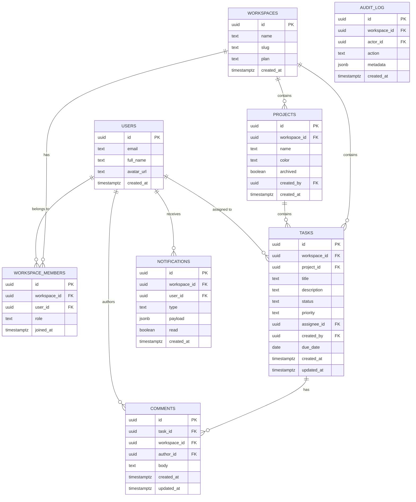

# Database Specification

**Project:** TaskFlow
**Version:** 1.0 (MVP)
**Status:** Approved
**Date:** 2026-05-13
**Author:** Database Engineer (BuildFlow Pro)

---

## 1. Entity Relationship Diagram



---

## 2. Table Definitions

### `workspaces`

| Column | Type | Constraints | Notes |
|---|---|---|---|
| `id` | `uuid` | PK, `gen_random_uuid()` | |
| `name` | `text` | NOT NULL | Display name |
| `slug` | `text` | NOT NULL, UNIQUE | URL-safe, lowercase |
| `plan` | `text` | NOT NULL, DEFAULT `'free'` | `free` \| `pro` |
| `created_at` | `timestamptz` | NOT NULL, DEFAULT `now()` | |

### `workspace_members`

| Column | Type | Constraints | Notes |
|---|---|---|---|
| `id` | `uuid` | PK, `gen_random_uuid()` | |
| `workspace_id` | `uuid` | FK → workspaces.id, NOT NULL | |
| `user_id` | `uuid` | FK → auth.users.id, NOT NULL | |
| `role` | `text` | NOT NULL | `admin` \| `manager` \| `member` \| `viewer` |
| `joined_at` | `timestamptz` | NOT NULL, DEFAULT `now()` | |

**Unique constraint:** `(workspace_id, user_id)`

### `projects`

| Column | Type | Constraints | Notes |
|---|---|---|---|
| `id` | `uuid` | PK, `gen_random_uuid()` | |
| `workspace_id` | `uuid` | FK → workspaces.id, NOT NULL | Tenant key |
| `name` | `text` | NOT NULL | |
| `color` | `text` | NOT NULL, DEFAULT `'blue'` | 8 preset colors |
| `archived` | `boolean` | NOT NULL, DEFAULT `false` | Soft delete |
| `created_by` | `uuid` | FK → auth.users.id, NOT NULL | |
| `created_at` | `timestamptz` | NOT NULL, DEFAULT `now()` | |

### `tasks`

| Column | Type | Constraints | Notes |
|---|---|---|---|
| `id` | `uuid` | PK, `gen_random_uuid()` | |
| `workspace_id` | `uuid` | FK → workspaces.id, NOT NULL | Tenant key |
| `project_id` | `uuid` | FK → projects.id, NOT NULL | |
| `title` | `text` | NOT NULL, length ≥ 1, ≤ 500 | |
| `description` | `text` | NULLABLE | Markdown allowed |
| `status` | `text` | NOT NULL, DEFAULT `'todo'` | `todo` \| `in-progress` \| `done` \| `archived` |
| `priority` | `text` | NOT NULL, DEFAULT `'medium'` | `low` \| `medium` \| `high` \| `urgent` |
| `assignee_id` | `uuid` | FK → auth.users.id, NULLABLE | |
| `created_by` | `uuid` | FK → auth.users.id, NOT NULL | |
| `due_date` | `date` | NULLABLE | |
| `created_at` | `timestamptz` | NOT NULL, DEFAULT `now()` | |
| `updated_at` | `timestamptz` | NOT NULL, DEFAULT `now()` | Updated by trigger |

### `comments`

| Column | Type | Constraints | Notes |
|---|---|---|---|
| `id` | `uuid` | PK, `gen_random_uuid()` | |
| `task_id` | `uuid` | FK → tasks.id, NOT NULL | |
| `workspace_id` | `uuid` | FK → workspaces.id, NOT NULL | Tenant key (denormalized for RLS) |
| `author_id` | `uuid` | FK → auth.users.id, NOT NULL | |
| `body` | `text` | NOT NULL, length ≥ 1 | Markdown |
| `created_at` | `timestamptz` | NOT NULL, DEFAULT `now()` | |
| `updated_at` | `timestamptz` | NOT NULL, DEFAULT `now()` | |

### `notifications`

| Column | Type | Constraints | Notes |
|---|---|---|---|
| `id` | `uuid` | PK, `gen_random_uuid()` | |
| `workspace_id` | `uuid` | FK → workspaces.id, NOT NULL | |
| `user_id` | `uuid` | FK → auth.users.id, NOT NULL | Recipient |
| `type` | `text` | NOT NULL | `task_assigned` \| `comment_mention` \| `task_due` |
| `payload` | `jsonb` | NOT NULL, DEFAULT `'{}'` | Context data |
| `read` | `boolean` | NOT NULL, DEFAULT `false` | |
| `created_at` | `timestamptz` | NOT NULL, DEFAULT `now()` | |

### `audit_log`

| Column | Type | Constraints | Notes |
|---|---|---|---|
| `id` | `uuid` | PK, `gen_random_uuid()` | |
| `workspace_id` | `uuid` | FK → workspaces.id, NOT NULL | |
| `actor_id` | `uuid` | FK → auth.users.id, NULLABLE | NULL for system actions |
| `action` | `text` | NOT NULL | `task.created`, `task.status_changed`, etc. |
| `metadata` | `jsonb` | NOT NULL, DEFAULT `'{}'` | Before/after state |
| `created_at` | `timestamptz` | NOT NULL, DEFAULT `now()` | **Immutable — no UPDATE allowed** |

---

## 3. Row Level Security (RLS) Policies

RLS is enabled on **all tables**. Base pattern: users can only access records belonging
to workspaces they are members of.

```sql
-- Helper function: get the calling user's workspace_id
CREATE OR REPLACE FUNCTION get_user_workspace_id()
RETURNS uuid AS $$
  SELECT workspace_id FROM workspace_members
  WHERE user_id = auth.uid()
  LIMIT 1;
$$ LANGUAGE sql STABLE SECURITY DEFINER;

-- Helper function: get the calling user's role in their workspace
CREATE OR REPLACE FUNCTION get_user_role()
RETURNS text AS $$
  SELECT role FROM workspace_members
  WHERE user_id = auth.uid()
  AND workspace_id = get_user_workspace_id()
  LIMIT 1;
$$ LANGUAGE sql STABLE SECURITY DEFINER;
```

### tasks — RLS Policies

```sql
ALTER TABLE tasks ENABLE ROW LEVEL SECURITY;

-- SELECT: workspace members can read all tasks in their workspace
CREATE POLICY "tasks_select" ON tasks FOR SELECT
  USING (workspace_id = get_user_workspace_id());

-- INSERT: managers and admins can create tasks
CREATE POLICY "tasks_insert" ON tasks FOR INSERT
  WITH CHECK (
    workspace_id = get_user_workspace_id()
    AND get_user_role() IN ('admin', 'manager', 'member')
  );

-- UPDATE: assignee or manager/admin can update tasks
CREATE POLICY "tasks_update" ON tasks FOR UPDATE
  USING (
    workspace_id = get_user_workspace_id()
    AND (assignee_id = auth.uid() OR get_user_role() IN ('admin', 'manager'))
  );

-- DELETE: admin or manager only
CREATE POLICY "tasks_delete" ON tasks FOR DELETE
  USING (
    workspace_id = get_user_workspace_id()
    AND get_user_role() IN ('admin', 'manager')
  );
```

### audit_log — Append-only Policy

```sql
ALTER TABLE audit_log ENABLE ROW LEVEL SECURITY;

-- SELECT: only admins can read audit log
CREATE POLICY "audit_log_select" ON audit_log FOR SELECT
  USING (workspace_id = get_user_workspace_id() AND get_user_role() = 'admin');

-- INSERT: service role only (via server-side service functions)
-- No UPDATE or DELETE policies — audit log is immutable
```

---

## 4. Index Strategy

```sql
-- Tasks: most common query pattern — workspace + project + status
CREATE INDEX idx_tasks_workspace_project ON tasks (workspace_id, project_id);
CREATE INDEX idx_tasks_assignee ON tasks (assignee_id) WHERE assignee_id IS NOT NULL;
CREATE INDEX idx_tasks_due_date ON tasks (due_date) WHERE due_date IS NOT NULL;
CREATE INDEX idx_tasks_status ON tasks (workspace_id, status);

-- Comments: always queried by task_id
CREATE INDEX idx_comments_task ON comments (task_id);

-- Notifications: always queried by user + unread
CREATE INDEX idx_notifications_user_unread ON notifications (user_id, read) WHERE read = false;

-- Audit log: always queried by workspace + time range
CREATE INDEX idx_audit_workspace_created ON audit_log (workspace_id, created_at DESC);
```

---

## 5. Migration Plan

| Migration | File | Description |
|---|---|---|
| 001 | `001_initial_schema.sql` | All tables, RLS, indexes |
| 002 | `002_seed_data.sql` | Demo workspace for development |

---

## 6. Rollback Plan

Each migration has a corresponding rollback script:

| Migration | Rollback | Action |
|---|---|---|
| `001_initial_schema.sql` | `rollback/001_drop_all.sql` | `DROP TABLE CASCADE` in reverse order |

**Rollback procedure:**

```bash
# 1. Confirm NO production data exists (new deploy only)
# 2. Connect to Supabase SQL editor
# 3. Run rollback script
# 4. Verify tables are dropped
# 5. Re-run correct migration
```

---

*Generated by BuildFlow Pro — Database Engineer skill*
*Template: `.antigravity/skills/database-engineer/templates/schema-template.sql`*
