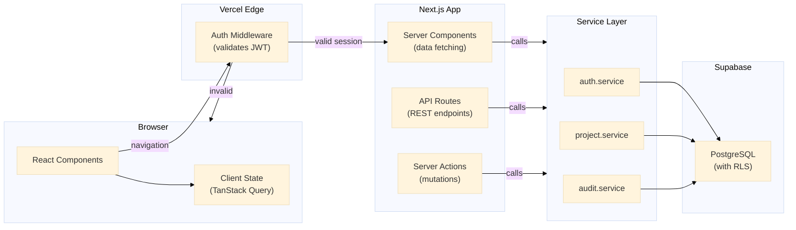
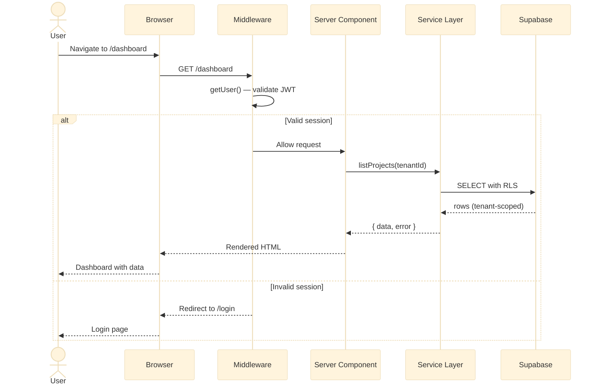
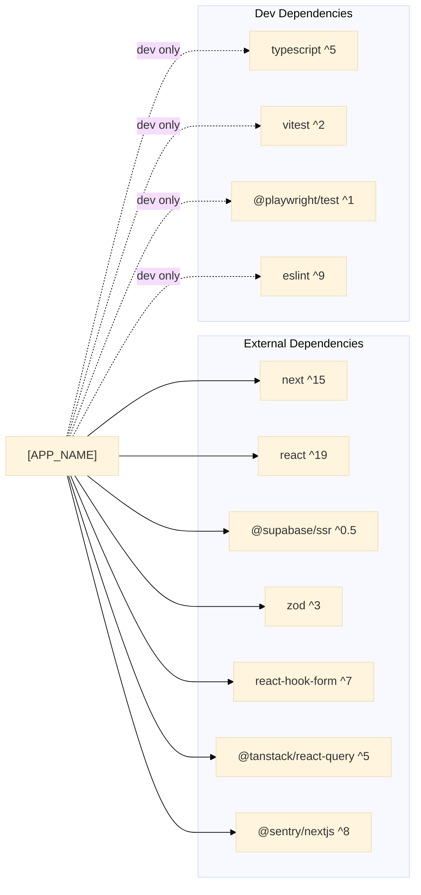
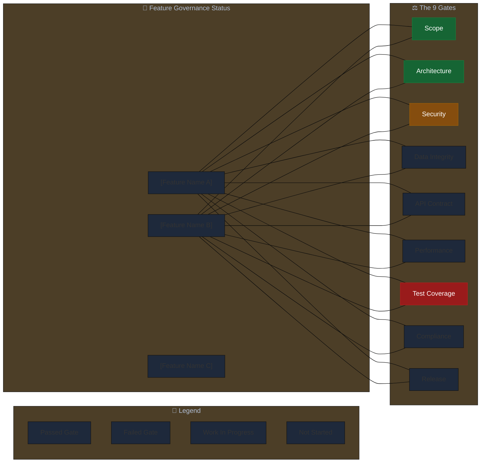

# Visualize Architecture
# BuildFlow Pro — Command
# Source: graphify pattern (knowledge graph visualization)

## Purpose

Read the project's `.antigravity/memory/architecture-graph.md` and generate a set of Mermaid diagrams that make the architecture visible and reviewable at a glance.

This command is used:
- After initial architecture design to confirm the design is correct
- Before any major refactoring to understand the blast radius
- During code review to verify a new component fits the architecture
- In team onboarding to explain the system quickly

---

## Step 1 — Load Architecture Graph

Read:
- `.antigravity/memory/architecture-graph.md` — primary source
- `docs/ARCHITECTURE.md` — supplementary context
- `docs/ADR/` — all ADR files for decision context

If `architecture-graph.md` is empty or contains only template placeholders, run the architecture design workflow first:
```
⚠️ Architecture graph is empty. Run /design-architecture to populate it first.
```

---

## Step 2 — Generate System Context Diagram (C4 Level 1)

```mermaid
%%{init: {'theme': 'base', 'themeVariables': {'primaryColor': '#1e293b', 'primaryTextColor': '#f8fafc', 'primaryBorderColor': '#334155', 'lineColor': '#64748b', 'secondaryColor': '#0f172a', 'tertiaryColor': '#1e293b'}}}%%
graph TB
    subgraph Users["👤 Users"]
        Admin["Admin\n(manages system)"]
        Member["Member\n(uses features)"]
        Viewer["Viewer\n(read-only access)"]
    end

    subgraph System["🏗️ [APP_NAME]"]
        Web["Next.js Web App\n(hosted on Vercel)"]
    end

    subgraph External["⚡ External Services"]
        Auth["Supabase Auth\n(authentication)"]
        DB["Supabase PostgreSQL\n(database + RLS)"]
        Storage["Supabase Storage\n(file storage)"]
        Monitor["Sentry\n(error monitoring)"]
        Analytics["PostHog\n(analytics)"]
    end

    Admin -->|"HTTPS"| Web
    Member -->|"HTTPS"| Web
    Viewer -->|"HTTPS"| Web

    Web -->|"Auth SDK"| Auth
    Web -->|"Supabase SDK"| DB
    Web -->|"Supabase SDK"| Storage
    Web -->|"SDK"| Monitor
    Web -->|"SDK"| Analytics

    style Users fill:#1e293b,stroke:#334155
    style System fill:#0f172a,stroke:#334155
    style External fill:#1e293b,stroke:#334155
```



---

## Step 3 — Generate Component Interaction Diagram (C4 Level 2)

Replace placeholders with actual components from the architecture graph:



---

## Step 4 — Generate Data Flow Diagram



---

## Step 5 — Generate God Node Impact Diagram

This diagram visualises which components are most dangerous to change (high centrality):

```mermaid
%%{init: {'theme': 'base'}}%%
graph TD
    subgraph GodNodes["⚠️ God Nodes — High Change Impact"]
        Auth["AuthProvider\n(all routes depend on this)"]
        Tenant["TenantContext\n(all DB queries depend on this)"]
        Supabase["supabase client\n(all data access depends on this)"]
    end

    subgraph Dependents["Components affected if God Nodes change"]
        AllRoutes["All API Routes"]
        AllPages["All Protected Pages"]
        AllServices["All Service Functions"]
        AllPolicies["All RLS Policies"]
    end

    Auth -->|"change breaks"| AllRoutes
    Auth -->|"change breaks"| AllPages
    Tenant -->|"change breaks"| AllServices
    Tenant -->|"change breaks"| AllPolicies
    Supabase -->|"change breaks"| AllServices
    Supabase -->|"change breaks"| AllRoutes

    style GodNodes fill:#7f1d1d,stroke:#991b1b
    style Dependents fill:#1e293b,stroke:#334155
```



---

## Step 6 — Generate Dependency Graph



---

## Step 7 — Generate Governance Health Map

This diagram visualises the "ready-for-production" status of major features across the 9 Gates:



---

## Step 8 — Generate Surprising Connections Summary

After generating diagrams, produce a written summary of the non-obvious dependencies from the architecture graph:

```markdown
## ⚡ Surprising Connections — Read Before Touching These

| If you change... | You will also affect... | Why |
|---|---|---|
| [Connection from architecture-graph.md] | | |
| `middleware.ts` | All server component data fetching | Middleware validates session before any server component runs |
| `audit.service.ts` | Perceived write performance | Every mutation writes to audit log synchronously |
| RLS policies | Service role client queries | Service role bypasses RLS — check all service-role queries after any RLS change |
```

---

## Step 8 — Write Output

Write all diagrams to: `docs/ARCHITECTURE_DIAGRAM.md`

Format:

```markdown
# Architecture Diagrams
# [APP_NAME] — Last Updated: [DATE]

## System Context (C4 Level 1)
[System context Mermaid diagram]

## Component Interaction (C4 Level 2)
[Component interaction Mermaid diagram]

## Authentication & Data Flow
[Sequence diagram]

## God Nodes — Change Impact
[God node diagram]

## Dependency Map
[Dependency Mermaid diagram]

## Governance Health Map
[Governance status Mermaid diagram]

## Surprising Connections
[Written summary table]
```

Announce completion:

```
✅ Architecture diagrams written to docs/ARCHITECTURE_DIAGRAM.md

  • System Context Diagram
  • Component Interaction Diagram (C4 L2)
  • Authentication + Data Flow Sequence
  • God Node Impact Map
  • Dependency Graph
  • Governance Health Map (9 Gates)
  • Surprising Connections Summary

Open docs/ARCHITECTURE_DIAGRAM.md to review.
The Mermaid diagrams render in GitHub, VS Code Preview, and most markdown viewers.
```

---

## Maintenance Protocol

Run `/visualize-architecture` again whenever:
- A new God Node is identified in the architecture graph
- A new external integration is added
- A service boundary changes
- A new team member joins (for onboarding)
- Architecture review is requested before a major feature

**The diagram is a snapshot. It becomes stale if not maintained alongside the code.**

---

## Verification

- [ ] All God Nodes from the architecture graph are shown in the impact diagram
- [ ] External integrations match what's in `docs/ARCHITECTURE.md`
- [ ] Surprising connections from the graph are included in the written summary
- [ ] Output is written to `docs/ARCHITECTURE_DIAGRAM.md`
- [ ] Diagrams render correctly in the markdown viewer
