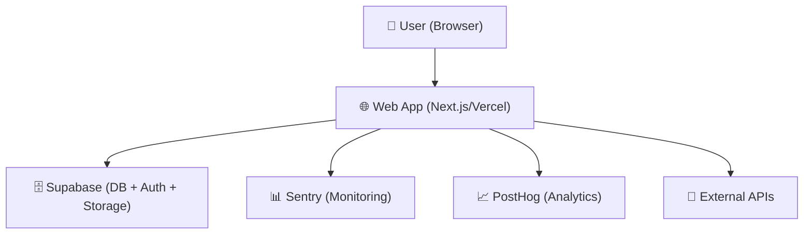
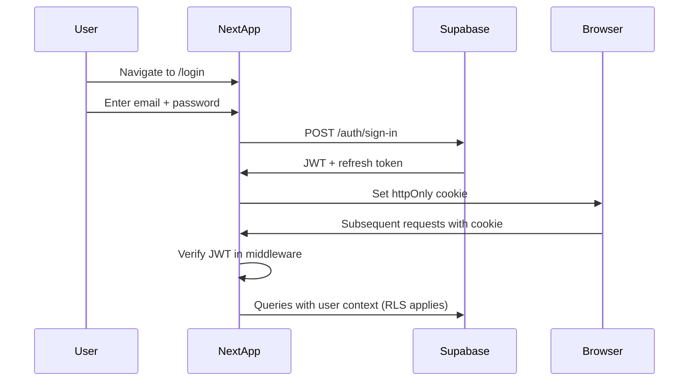

# Technical Architecture
# [App Name] — Architecture v1.0

**Date:** [date]
**Status:** Draft / Approved
**Author:** BuildFlow Pro — Software Architect

---

## 1. Architecture Overview

[One paragraph summary of the system.]

---

## 2. System Context Diagram



---

## 3. Tech Stack

| Layer | Technology | Version | Justification |
|---|---|---|---|
| Framework | Next.js | 14+ | App Router, SSR, Vercel native |
| Language | TypeScript | 5+ | Type safety, better DX |
| UI | Tailwind CSS | 3+ | Utility-first, fast iteration |
| Components | shadcn/ui | Latest | Accessible, customizable |
| Database | Supabase PostgreSQL | 15+ | RLS, realtime, auth built-in |
| Auth | Supabase Auth | Latest | JWT, OAuth, MFA ready |
| Storage | Supabase Storage | Latest | RLS, CDN, co-located |
| Hosting | Vercel | — | Next.js native, preview URLs |
| CI/CD | GitHub Actions | — | Free, powerful, PR integration |
| Monitoring | Sentry | Latest | Error tracking, performance |
| Analytics | PostHog | Latest | Product analytics, funnels |

---

## 4. Frontend Architecture

**Framework:** Next.js 14 App Router
**Rendering Strategy:**
- Server Components by default
- Client Components only when interactivity required

**Folder Structure:**
```
src/
  app/
    (auth)/         — login, signup pages
    (dashboard)/    — authenticated app pages
    api/            — API routes
  components/
    ui/             — shadcn/ui components
    layout/         — Sidebar, TopBar, etc.
    shared/         — Loading, Empty, Error states
  lib/
    supabase/       — client and server instances
    validations/    — Zod schemas
    utils.ts        — helpers
  services/         — business logic service functions
  hooks/            — custom React hooks
  types/            — TypeScript interfaces
```

**State Management:**
- Server state: TanStack Query / Next.js server actions
- UI state: React useState / useReducer
- Global auth state: Supabase auth listener

---

## 5. Backend Architecture

**API Strategy:** Next.js Server Actions + API Routes
**Validation:** Zod at all boundaries
**Authorization:** RBAC enforced at service layer
**Error Handling:** Structured `{ data, error }` responses

**Service Layer Pattern:**
```
UI Component
  → Server Action / API Route (auth check)
    → Service Function (authorization + validation)
      → Database Query (with tenant filter)
        → Audit Log
```

---

## 6. Database Architecture

**Database:** Supabase PostgreSQL
**Multi-tenancy:** Shared database with RLS
**ORM:** Supabase JS client (type-safe)
**Migrations:** SQL migration files in `database/migrations/`

**Tenant isolation strategy:** Row Level Security (RLS) on all tenant tables. Every query filtered by `tenant_id`.

---

## 7. Authentication Flow



---

## 8. Authorization Model

RBAC enforced at service layer. Roles stored in user metadata.

| Role | Access Level |
|---|---|
| super_admin | All tenants, all data |
| admin | Own tenant, all data |
| manager | Own tenant, team data |
| member | Own tenant, own data |
| viewer | Own tenant, read only |

---

## 9. Deployment Architecture

```
Developer → Git Push → GitHub
                           ↓
                    GitHub Actions CI
                    (lint + test + build)
                           ↓ (if passing)
                    Vercel Deployment
                    ↓              ↓
              Preview URL    Production URL
              (per PR)       (main branch)
```

---

## 10. Observability Plan

| Concern | Tool | What to Monitor |
|---|---|---|
| Errors | Sentry | Uncaught exceptions, API errors |
| Performance | Sentry Performance | Page load, API response times |
| Analytics | PostHog | User flows, feature adoption |
| Uptime | Vercel / UptimeRobot | Health endpoint availability |
| Logs | Vercel Logs | Structured server logs |

---

## 11. Security Model

- **Auth:** Supabase JWT, httpOnly cookies
- **Authorization:** RBAC at service layer
- **Data isolation:** RLS on all tenant tables
- **Secrets:** .env files, never committed
- **Input:** Zod validation at all boundaries
- **File uploads:** Type + size restricted

---

*Generated by BuildFlow Pro — Software Architect Skill*
